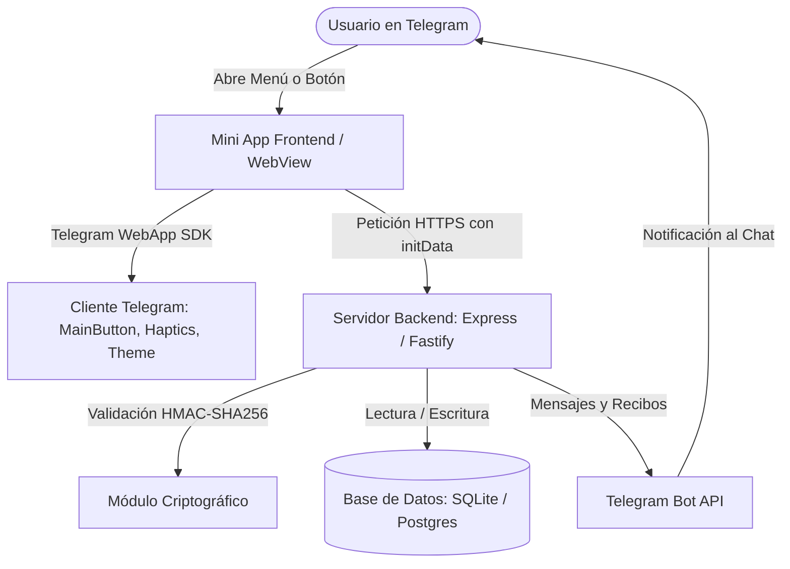
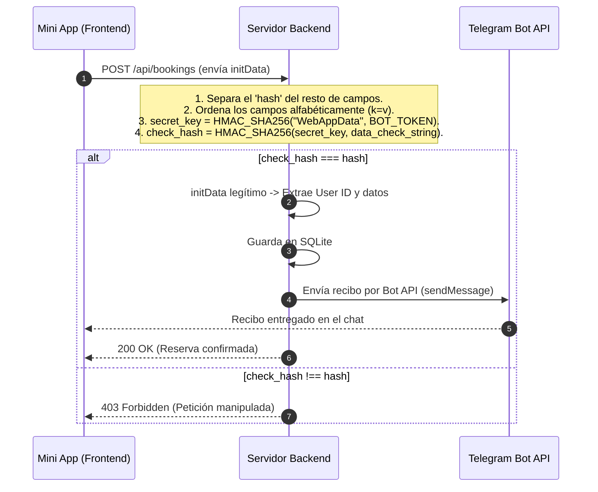

# Guía Maestra y Tutorial: Desarrollo de Telegram Mini Apps (TMA) desde Cero

Este documento constituye una guía técnica, conceptual y pedagógica exhaustiva diseñada para servir como base de un tutorial formativo sobre **Telegram Mini Apps (TMA)**. No asume conocimientos previos sobre el ecosistema de Telegram y explica cada componente desde sus fundamentos hasta su puesta en producción.

---

## 📑 Índice de Contenidos
1. [¿Qué son las Telegram Mini Apps (TMA)?](#1-qué-son-las-telegram-mini-apps-tma)
2. [Arquitectura y Tecnologías Clave](#2-arquitectura-y-tecnologías-clave)
3. [El Telegram WebApp SDK: La Magia de la Integración](#3-el-telegram-webapp-sdk-la-magia-de-la-integración)
4. [Seguridad y Autenticación Criptográfica (initData)](#4-seguridad-y-autenticación-criptográfica-initdata)
5. [Desglose Técnico de la Aplicación DevStudio](#5-desglose-técnico-de-la-aplicación-devstudio)
6. [Guía Práctica Paso a Paso: Instalación, Configuración y Despliegue](#6-guía-práctica-paso-a-paso-instalación-configuración-y-despliegue)
7. [Buenas Prácticas, Errores Comunes y Siguientes Pasos](#7-buenas-prácticas-errores-comunes-y-siguientes-pasos)

---

## 1. ¿Qué son las Telegram Mini Apps (TMA)?

### 1.1 El Concepto
Una **Telegram Mini App (TMA)** es una aplicación web moderna (creada con HTML5, CSS y JavaScript o frameworks como React, Vue, Svelte, etc.) que se ejecuta **dentro de la propia aplicación de Telegram** a través de un WebView integrado y enriquecido.

Lejos de ser un simple navegador incrustado, las Mini Apps tienen acceso bidireccional a las funciones nativas del dispositivo y de la plataforma Telegram: saben quién es el usuario de forma segura, adaptan sus colores al tema de la app, pueden vibrar (*haptic feedback*), controlar botones nativos del sistema y comunicarse con bots de chat.

```
┌─────────────────────────────────────────────────────────────┐
│                      TELEGRAM CLIENT                        │
│                                                             │
│   ┌─────────────────────────────────────────────────────┐   │
│   │            TELEGRAM MINI APP (WEBVIEW)              │   │
│   │                                                     │   │
│   │  • Interfaz Web fluida (HTML/CSS/JS/React)          │   │
│   │  • Adaptación a Tema (Dark/Light mode)              │   │
│   │  • Botones Nativos (MainButton, BackButton)         │   │
│   │  • Retroalimentación Háptica (Vibración)            │   │
│   │  • Autenticación Criptográfica (initData)           │   │
│   └──────────────────────────▲──────────────────────────┘   │
└──────────────────────────────┼──────────────────────────────┘
                               │ HTTPS
                               ▼
┌─────────────────────────────────────────────────────────────┐
│                  TU SERVIDOR WEB / BACKEND                  │
│                                                             │
│  • API REST / WebSockets (Node.js, Python, Go, etc.)        │
│  • Validador Criptográfico HMAC-SHA256                      │
│  • Base de Datos (SQLite, PostgreSQL, MongoDB, etc.)        │
│  • Notificaciones y Bot API de Telegram                     │
└─────────────────────────────────────────────────────────────┘
```

### 1.2 ¿Por qué representan una revolución frente a las Apps Tradicionales?

| Característica | App Móvil Tradicional (App Store / Google Play) | Telegram Mini App (TMA) |
| :--- | :--- | :--- |
| **Instalación** | Requiere descarga de 50-200 MB desde una tienda | **Instantánea** (0 segundos, carga en streaming como una web) |
| **Registro / Login** | Formularios de email, contraseñas, confirmaciones | **Sin fricción:** Identidad del usuario validada por Telegram |
| **Multiplataforma** | Código separado para iOS, Android, Desktop y Web | **Un solo código:** Funciona idéntico en iPhone, Android, Mac, Windows y Web |
| **Actualizaciones** | Revisión de tiendas (días de espera) | **Inmediatas:** Despliegas tu web y todos la ven actualizada al instante |
| **Pagos y Cobros** | Comisiones del 15-30% de Apple/Google | **Flexibles:** Telegram Stars, TON Crypto, Stripe, pasarelas propias |
| **Viralidad** | Difícil compartir enlaces de apps | **Extrema:** Se comparte con un botón dentro de cualquier chat o grupo |

---

## 2. Arquitectura y Tecnologías Clave

Para construir una Telegram Mini App lista para producción intervienen cuatro capas tecnológicas:



1. **El Frontend (Interfaz de Usuario):**
   - Cualquier tecnología web moderna (HTML5/CSS/JavaScript vanilla, React, Vue, Angular, Svelte, TailwindCSS).
   - Se incluye el script oficial: `<script src="https://telegram.org/js/telegram-web-app.js"></script>`.
2. **El Backend (Lógica de Negocio y Seguridad):**
   - Servidor HTTP (Node.js con Express, Python con FastAPI, Go, etc.).
   - Expone rutas API para consultar catálogos, procesar reservas/pedidos y verificar la identidad del cliente.
3. **La Capa de Persistencia:**
   - Base de datos relacional o NoSQL (SQLite, PostgreSQL, MongoDB, Redis, etc.) para guardar el estado de los pedidos, reservas e historiales de los usuarios.
4. **El Bot de Telegram:**
   - La entidad anfitriona en `@BotFather`. Actúa como punto de acceso y canal de comunicación bidireccional (envío de recibos, recordatorios y soporte).

---

## 3. El Telegram WebApp SDK: La Magia de la Integración

El objeto `window.Telegram.WebApp` (alias `tg`) es el puente entre tu página web y el cliente de Telegram.

### 3.1 Métodos de Inicialización
```javascript
const tg = window.Telegram.WebApp;

// 1. Notificar a Telegram que la app está lista para renderizarse
tg.ready();

// 2. Expandir la vista al máximo tamaño de la pantalla
tg.expand();

// 3. Evitar que el usuario cierre la app por accidente al deslizar el dedo
tg.enableClosingConfirmation();
```

### 3.2 Adaptación Automática de Temas (Dark / Light Mode)
Telegram inyecta automáticamente variables CSS con la paleta de colores del usuario:

```css
:root {
  --bg: var(--tg-theme-bg-color, #ffffff);
  --text: var(--tg-theme-text-color, #000000);
  --hint: var(--tg-theme-hint-color, #888888);
  --btn-bg: var(--tg-theme-button-color, #2481cc);
  --btn-text: var(--tg-theme-button-text-color, #ffffff);
  --sec-bg: var(--tg-theme-secondary-bg-color, #f4f4f5);
}
```
> Esto garantiza que si el usuario tiene Telegram en modo oscuro, tu app será oscura; si usa modo claro, será clara, ofreciendo una experiencia 100% nativa.

### 3.3 El Botón Principal Nativo (`MainButton`)
En lugar de diseñar un botón flotante propio, Telegram ofrece un botón nativo en la parte inferior del dispositivo:

```javascript
// Configurar y mostrar el botón principal
tg.MainButton.setText("Confirmar Pedido • 120,00 €");
tg.MainButton.show();
tg.MainButton.enable();

// Asignar evento de pulsación
tg.MainButton.onClick(() => {
  tg.MainButton.showProgress(); // Muestra spinner de carga
  procesarPedido();
});
```

### 3.4 El Botón de Volver Atrás (`BackButton`)
Aparece en la barra superior izquierda de Telegram y se sincroniza con tu navegación interna:

```javascript
tg.BackButton.show();
tg.BackButton.onClick(() => {
  navegarHaciaAtras();
});
```

### 3.5 Retroalimentación Háptica (`HapticFeedback`)
Permite hacer vibrar el teléfono con precisión ante interacciones del usuario:

```javascript
// Al pulsar botones o cambiar pestañas
tg.HapticFeedback.selectionChanged();

// Al seleccionar un producto o abrir un modal
tg.HapticFeedback.impactOccurred('medium'); // 'light', 'medium', 'heavy', 'rigid', 'soft'

// Al completar una compra o recibir un error
tg.HapticFeedback.notificationOccurred('success'); // 'error', 'warning', 'success'
```

---

## 4. Seguridad y Autenticación Criptográfica (initData)

Una de las mayores ventajas de las Mini Apps es que **el usuario no necesita crearse una cuenta con contraseña**. Telegram proporciona su identidad verificada a través de `tg.initData`.

### 4.1 ¿Qué es `initData`?
Es una cadena codificada enviada por Telegram al cargar la Mini App. Contiene información del usuario junto con una firma criptográfica:

```text
query_id=AAHd...&user=%7B%22id%22%3A778899%2C%22first_name%22%3A%22Alex%22%2C%22username%22%3A%22alex_dev%22%7D&auth_date=1723910400&hash=d8a4f9b...
```

> [!CAUTION]
> **Regla de Oro de Seguridad:** Nunca debes confiar en los datos de usuario que el frontend envía por sí solo, porque un atacante podría manipularlos. Es **obligatorio** verificar el `hash` en tu backend antes de aceptar pedidos o modificar datos.

### 4.2 Proceso Matemático de Validación en Backend (HMAC-SHA256)



Código de validación en Node.js ([`server/auth.js`](file:///Volumes/MisAppsV/telegram/server/auth.js)):

```javascript
import crypto from 'crypto';

export function validateTelegramInitData(initData, botToken) {
  const urlParams = new URLSearchParams(initData);
  const hash = urlParams.get('hash');
  urlParams.delete('hash');

  // 1. Ordenar claves alfabéticamente
  const keys = Array.from(urlParams.keys()).sort();
  const dataCheckString = keys.map(k => `${k}=${urlParams.get(k)}`).join('\n');

  // 2. Clave secreta basada en el Token del Bot
  const secretKey = crypto.createHmac('sha256', 'WebAppData').update(botToken).digest();

  // 3. Calcular hash de comprobación
  const calculatedHash = crypto.createHmac('sha256', secretKey).update(dataCheckString).digest('hex');

  // 4. Comparación de tiempo constante (segura contra timing attacks)
  const isMatch = crypto.timingSafeEqual(Buffer.from(hash, 'hex'), Buffer.from(calculatedHash, 'hex'));
  
  if (!isMatch) return { validated: false };
  return { validated: true, user: JSON.parse(urlParams.get('user')) };
}
```

---

## 5. Desglose Técnico de la Aplicación DevStudio

La aplicación desarrollada en este proyecto (`DevStudio - Servicios & Reservas para Desarrolladores Web`) está organizada de forma limpia, modular y sin dependencias innecesarias:

```
telegram/
├── server/
│   ├── index.js          # Servidor Express, endpoints de API y configuración de cabeceras
│   ├── auth.js           # Validación criptográfica de initData (HMAC-SHA256)
│   ├── bot.js            # Lógica del Bot de Telegram (recibos HTML y polling /start)
│   ├── db.js             # Base de datos SQLite (tablas services, users, bookings)
│   └── data/
│       └── services.json # Catálogo semilla inicial de servicios
├── client/
│   ├── index.html        # Estructura de la Mini App con tabs (Catálogo, Reservas, Historial)
│   ├── style.css         # Estilos responsive con variables de tema nativas de Telegram
│   └── app.js            # Integración con WebApp SDK (MainButton, Haptics, Simulator)
├── start.js              # Arranque del servidor + Cloudflare Tunnel + Auto-config de Telegram
├── data.sqlite           # Base de datos relacional local
├── package.json          # Dependencias (Express, better-sqlite3, cors, dotenv)
└── .env                  # Variables de entorno (PORT, TELEGRAM_BOT_TOKEN)
```

### Componentes Destacados:
1. **Modo Simulador de Navegador ([`client/app.js`](file:///Volumes/MisAppsV/telegram/client/app.js)):**
   Permite abrir la app en `http://localhost:3000` en Chrome o Safari para desarrollar a gran velocidad. Incluye una barra para simular usuarios, cambiar el tema (claro/oscuro) y verificar el comportamiento del formulario antes de probarlo en Telegram.
2. **Cabeceras de Incrustación Seguras ([`server/index.js`](file:///Volumes/MisAppsV/telegram/server/index.js)):**
   Para evitar que el navegador bloquee la app dentro de Telegram Web, el servidor elimina `X-Frame-Options` y añade:
   ```javascript
   res.setHeader('Content-Security-Policy', "frame-ancestors * 'self' https://*.telegram.org https://web.telegram.org;");
   ```
3. **Generación Automática de Recibos ([`server/bot.js`](file:///Volumes/MisAppsV/telegram/server/bot.js)):**
   Al confirmar la reserva, el bot redacta un recibo con formato HTML enriquecido y lo envía directamente al chat privado del cliente.

---

## 6. Guía Práctica Paso a Paso: Instalación, Configuración y Despliegue

### Paso 1: Configurar Telegram en el Navegador
1. Ingresa a **[web.telegram.org](https://web.telegram.org)**.
2. Introduce tu número de teléfono e introduce el código SMS de verificación para acceder a tu cuenta.

### Paso 2: Crear el Bot con `@BotFather`
1. En el buscador de Telegram, busca a **`@BotFather`** (asegúrate de que tenga el distintivo azul de cuenta verificada).
2. Pulsa **Start** o escribe:
   ```text
   /newbot
   ```
3. Indica el **nombre público** de tu bot (ej: `DevStudio Reservas`).
4. Indica el **username único** (debe terminar en `bot`, ej: `devstudio_jesus_bot`).
5. Copia el **Token de API** que te entrega BotFather (ej: `1234567890:ABCdefGHIjklMNOpqrsTUVwxyz`).

### Paso 3: Configurar el archivo `.env`
Crea o edita el archivo `.env` en la raíz de tu proyecto:
```env
PORT=3000
TELEGRAM_BOT_TOKEN=PEGA_AQUI_TU_TOKEN
BASE_URL=http://localhost:3000
```

### Paso 4: Levantar el Servidor con Túnel Seguro (Cloudflare)
Telegram **exige obligatoriamente que las Mini Apps funcionen bajo HTTPS**. Para exponer tu servidor local de forma inmediata sin pagar servidores ni configurar certificados SSL:

Ejecuta el script unificado:
```bash
npm start
```

El script:
1. Inicia el servidor Node.js y la base de datos SQLite en `http://localhost:3000`.
2. Lanza un túnel seguro mediante `npx cloudflared tunnel`.
3. Obtiene una URL HTTPS pública (ej. `https://xxx.trycloudflare.com`).
4. **Llama automáticamente a la Telegram Bot API (`setChatMenuButton`)** para vincular el botón del menú de tu bot con la nueva URL.

### Paso 5: ¡Probar la App en Vivo!
1. Abre el chat con tu bot (`@tu_bot_name`) en Telegram Web o en tu móvil.
2. Pulsa el botón inferior **`🚀 Servicios & Reservas`** o escribe `/start`.
3. La Mini App se abrirá inmediatamente a pantalla completa.
4. Elige un servicio, selecciona fecha/hora y pulsa el **botón azul flotante inferior**.
5. ¡Observa cómo el bot te entrega el recibo en el chat en tiempo real!

---

## 7. Buenas Prácticas, Errores Comunes y Siguientes Pasos

### ⚠️ Errores Típicos a Evitar:
* **Usar túneles con pantallas intermedias (*Interstitial Pages*):** Herramientas como Ngrok gratuito o Localtunnel a veces muestran una pantalla de "Click to continue". En un navegador normal se puede pulsar, pero dentro del WebView de Telegram provoca una **pantalla en blanco** o error **Bad Gateway (502)**. *Cloudflare Quick Tunnels resuelve esto por completo.*
* **Olvidar las cabeceras `frame-ancestors`:** Si tu servidor tiene configurado `X-Frame-Options: DENY`, Telegram Web no podrá incrustar la web en su iframe.
* **No usar `ready()` y `expand()`:** Si no ejecutas `tg.ready()`, la interfaz puede quedarse congelada esperando señal de renderizado.

### 🚀 Opciones de Escalabilidad para Producción:
1. **Alojamiento permanente del Frontend:** Desplegar en **Vercel**, **Cloudflare Pages** o **Netlify** (gratuitos, con HTTPS automático y CDN global).
2. **Alojamiento del Backend:** Desplegar en **Railway**, **Render** o un VPS (Hetzner/DigitalOcean) con Docker.
3. **Monetización:** Integrar **Telegram Stars** para pagos digitales nativos con 1 solo clic dentro de la app o Stripe para pagos con tarjeta.
